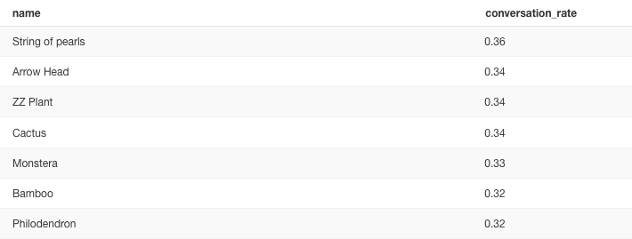

# week 3 Project Questions and Answers

## Q1: What is our overall conversion rate?
####  Ans: **71%**

Code:
```sql
  select
    round(sum(no_of_orders_in_session::numeric) / count(distinct session_id),2) * 100 as overall_convertion_rate
  from 
    dbt_gaurang_s.fct_session_events
  where no_of_products_viewed::numeric >1 
 
```


## Q2: What is our conversion rate by product?
####  Ans: 


Code:
```sql
select 
    name
    , conversation_rate
  from dbt_gaurang_s.fct_product_events
  order by conversation_rate desc
```

